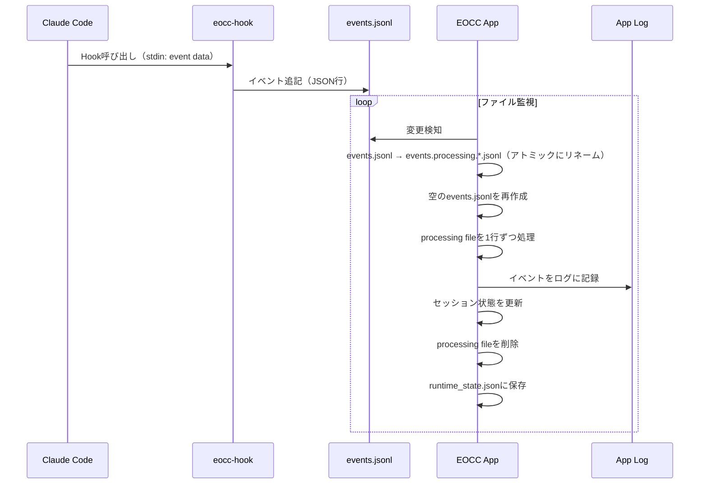

<p align="center">
  <a href="./README.md">English</a> | 日本語
</p>

# Eyes on Claude Code

Claude Code の **グローバルHooks** からイベントを収集し、複数プロジェクトのセッション状態を **メニューバー（トレイ）** と **ダッシュボード** で一覧できるアプリケーションです。


---

## 1. setup

### 対応プラットフォーム

- [x] macOS（12+）
- [ ] Linux（動作未検証）
- [ ] Windows（動作未検証。windowsユーザの方のコントリビューションをお待ちしています🙇🏻‍♂️）

### 前提

- Claude Code
- Node.js v23+

### インストール

#### 方法1: リリースからダウンロード（推奨）

1. [Releases](https://github.com/joe-re/eyes-on-claude-code/releases) ページにアクセス
2. お使いのプラットフォームに対応したファイルをダウンロード：
   - **macOS**: `.dmg` ファイル
   - **Linux**: `.deb` または `.AppImage` ファイル
   - **Windows**: `.msi` または `.exe` ファイル
3. インストールしてアプリを起動

> [!Note]
> macOSでは「アプリが壊れているため開けません」というエラーが表示される場合があります。[トラブルシューティング](#macos-アプリが壊れているため開けません)を参照してください。

#### 方法2: ソースコードからビルド

```bash
# リポジトリをクローン
git clone https://github.com/joe-re/eyes-on-claude-code.git
cd eyes-on-claude-code

# 依存関係をインストール
pnpm install

# 開発モードで実行
pnpm tauri dev

# または本番用にビルド
pnpm tauri build
```

### 初回起動

初回起動時にはアプリケーション上にhooksの設定のインストラクションが表示されます。


Setupモーダルの指示に従って、生成された設定を `~/.claude/settings.json` に反映してください。


> [!Note]
> Setupモーダル上で表示されているJSONは既存設定を読み込み、**hooksだけを差し替える** JSON を生成します（古い eocc hooks は置換され、他のhooks/設定は保持されます）。


## 2. 使い方

### ダッシュボード

- ダッシュボードには Sessions 一覧が表示されます。


#### ステータス表示（右上）

- `Monitoring`: **Waiting状態のセッションが0件**（監視中）
- `N waiting`: `WaitingPermission` または `WaitingInput` のセッションが **N件**
  - 右上のドットも waiting のときは警告色＋点滅表示になります

#### セッション状態と表示

セッションの状態は以下の4種類で、一覧/トレイ/メニュー表示にも反映されます。

| 状態 | 意味 | 表示（絵文字） |
|---|---|---|
| `Active` | Claudeが作業中/通常状態 | 🟢 |
| `WaitingPermission` | Claude Code が権限許可待ち | 🔐 |
| `WaitingInput` | 入力待ち（アイドル等） | ⏳ |
| `Completed` | 応答完了 | ✅ |

### セッションカード

- カードをクリックすると展開し、Gitの状態が表示されます。


#### Diff（difit連携）

Diffをクリックすると [difit](https://github.com/yoshiko-pg/difit) を起動し、diffの確認ができます。(Thanks the awesome product for difit dev team! 🙇🏻‍♂️)

- `unstaged`: 作業ツリーの差分
- `staged`: indexの差分
- `commit`: 最新コミットの差分（`HEAD~1..HEAD`）
- `branch`: デフォルトブランチ（自動検出）との比較

> [!NOTE]
> Diff表示は内部で `npx difit` を対象リポジトリ内で起動します。そのためNode.js（`npx`）が必要です。  
> 対象がGitリポジトリでない場合、または差分が無い場合は開けません。

### ウィンドウ操作/設定

- Always on Top の切替に対応します。
- フォーカス状態に応じてOpacityを変えられます。
  - difitウィンドウがフォーカスされるとダッシュボードは「非アクティブ」として扱われます。
- Sound をONにすると、状態変化に応じて効果音が鳴ります。
  - Waiting（Permission/Input）: 注意音
  - Completed: 完了音

#### 透過設定

- ダッシュボードは **アクティブ/非アクティブ** で透過率（Opacity）を切り替えます。
  - **Active**: ダッシュボードにフォーカスがあるとき（初期値: 100%）
  - **Inactive**: フォーカスが無いとき（初期値: 30%）
- 透過率はメニューバーの **Window → Opacity** から変更できます。

---

## 3. サポート機能一覧

- 複数セッション監視
- 状態表示: Active / WaitingPermission / WaitingInput / Completed
- waiting数の可視化
- Git情報の表示: ブランチ名、unstaged/staged有無、最新コミット
- Diff表示: difit（`npx difit`）で差分を別ウィンドウに表示
- 通知音: waiting / completed を音で通知（SoundのON/OFFあり）

## 4. Information for development

### 必要環境

- Rust（`rustup`）
- Node.js（`npx`含む）
- pnpm

### セットアップ

```bash
pnpm install
```

### 開発起動

```bash
pnpm tauri dev
```

### 生成されるファイル/保存先

**Hook/ログ**

```
~/.local/bin/
  └── eocc-hook              # Hookスクリプト（アプリが作るシンボリックリンク）

~/.claude/
  └── settings.json          # グローバルHooks設定

~/.eocc/
  └── logs/
      └── events.jsonl       # イベントキュー（アプリ処理後にクリアされる）
```

**アプリデータ**

```
~/Library/Application Support/tech.joe-re.eocc/  # macOS
  ├── settings.json          # アプリ設定
  └── runtime_state.json     # セッション状態（アプリ再起動時に復元）

~/Library/Logs/tech.joe-re.eocc/  # macOS
  └── *.log                  # アプリログ
```

### 監視イベント（Hook）

Hookスクリプトはイベントを `events.jsonl` に追記します。

| event | 用途 | セッション状態への反映 |
|---|---|---|
| `session_start` (startup/resume) | セッション開始 | Activeとして登録 |
| `session_end` | セッション終了 | セッション削除 |
| `notification` (permission_prompt) | 承認待ち | WaitingPermission |
| `notification` (idle_prompt) | 入力待ち | WaitingInput |
| `stop` | 応答完了 | Completed |
| `post_tool_use` | ツール実行後 | Active |
| `user_prompt_submit` | プロンプト送信 | Active |

### イベント処理フロー



### ビルド

```bash
pnpm tauri build
```

成果物（macOS例）:

- `src-tauri/target/release/bundle/macos/Eyes on Claude Code.app`
- `src-tauri/target/release/bundle/dmg/Eyes on Claude Code_1.0.0_aarch64.dmg`

### リリース

リリースはGitHub Actionsで自動化されています。新しいリリースを作成するには:

1. `src-tauri/tauri.conf.json` と `package.json` のバージョンを更新
2. バージョン更新をコミット
3. バージョンタグを作成してプッシュ:
   ```bash
   git tag v1.0.1
   git push origin v1.0.1
   ```
4. GitHub Actionsが自動的にすべてのプラットフォーム向けにビルドし、ドラフトリリースを作成
5. GitHubでリリースノートを確認し、公開

#### 対応プラットフォーム

| プラットフォーム | アーキテクチャ | 成果物 |
|----------|--------------|----------|
| macOS | Apple Silicon (aarch64) | `.dmg`, `.app` |
| macOS | Intel (x86_64) | `.dmg`, `.app` |
| Linux | x64 | `.deb`, `.AppImage` |
| Windows | x64 | `.msi`, `.exe` |

#### 手動ローカルビルド

特定のプラットフォーム向けにローカルでビルドする場合:

```bash
# macOS（現在のアーキテクチャ）
pnpm tauri build

# クロスコンパイル（適切なツールチェーンが必要）
pnpm tauri build --target aarch64-apple-darwin
pnpm tauri build --target x86_64-apple-darwin
```

#### アイコン生成

ソースPNGからアイコンを再生成する場合:

```bash
./scripts/generate-icons.sh
# または
pnpm tauri icon src-tauri/icons/icon.png
```

## 5. troubleshooting

### macOS: 「アプリが壊れているため開けません」

このエラーはアプリがApple Developer証明書で署名・公証されていないために発生します。以下のコマンドで回避できます：

```bash
xattr -cr "/Applications/Eyes on Claude Code.app"
```

マウントしたDMGから開く場合：

```bash
xattr -cr "/Volumes/Eyes on Claude Code/Eyes on Claude Code.app"
```

> [!Note]
> Apple Developer証明書による署名は将来のリリースで対応予定です。

### Setupモーダルが消えない（hooksがNGのまま）

- `~/.claude/settings.json` を開き、Setupモーダルで生成した内容に反映できているか確認
- Claude Codeで `/hooks` を実行して、hooksが読み込まれているか確認
- `~/.local/bin/eocc-hook` の存在/実行権限を確認
  - `ls -la ~/.local/bin/eocc-hook`
- Node.js が利用できるか確認
  - `command -v node`

### ログが増えない / セッションが表示されない

- アプリログを確認
  - `ls -la ~/Library/Logs/tech.joe-re.eocc/`
  - `cat ~/Library/Logs/tech.joe-re.eocc/*.log | grep -i error`
- `events.jsonl` が作成/更新されているか確認
  - `ls -la ~/.eocc/logs/`
- Hookが呼ばれているか確認（Claude Codeで `/hooks` を実行）

### Diffが開けない

- 対象がGitリポジトリか確認（`.git` が無いとエラーになります）
- 差分が無いと「No diff content to display」になり開けません
- Node.js（`npx`）が利用できるか確認
  - `command -v node && command -v npx`
- 環境によっては `npx` が `difit` を取得するためネットワークが必要です

### 音が鳴らない

- メニューの Sound がONになっているか確認
- ブラウザ/OS側の制限でAudioがブロックされる場合があります（設定変更後に再度状態変化を発生させて確認してください）

## 6. ライセンス

本プロジェクトは **MIT License** で公開します。`LICENSE` を参照してください。

依存関係（Node/Rust）のライセンス概要と、依存ライセンスレポート生成手順は `THIRD_PARTY_NOTICES.md` を参照してください。

## 7. プライバシー / データの取り扱い

- **ローカル完結**: 本アプリはHookイベントをローカルで処理し、テレメトリ/解析目的の送信は実装していません。
- **保存されるもの**:
  - `~/.eocc/logs/events.jsonl`: Hookが追記するイベントキュー（アプリが処理後に消費/クリア）
  - アプリログ: 生のイベントJSON行もアプリログに出力されます（`tauri-plugin-log` によりローテート）
- **注意**: Claude Code 側のHookペイロードによっては `message` などが含まれるため、機密情報が混ざり得ます。
