<p align="center">
  <a href="./README.md">English</a> | 日本語
</p>

# Eyes on Claude Code

Claude Code の **グローバルHooks** からイベントを収集し、複数プロジェクトのセッション状態を **メニューバー（トレイ）** と **ダッシュボード** で一覧できるアプリケーションです。


---

## 1. setup

### 前提

- Claude Code
- Node.js v23+

### 初回起動

初回起動時にはアプリケーション上にhooksの設定のインストラクションが表示されます。


Setupモーダルの指示に従って、生成された設定を `~/.claude/settings.json` に反映してください。


> [!Note]
> Setupモーダル上で表示されているJSONは既存設定を読み込み、**hooksだけを差し替える** JSON を生成します（古い eocc hooks は置換され、他のhooks/設定は保持されます）。


## 2. 使い方

### ダッシュボード

- ダッシュボードには Sessions 一覧が表示されます。


#### ステータス表示（右上）

- `Monitoring`: **Waiting状態のセッションが0件**（監視中）
- `N waiting`: `WaitingPermission` または `WaitingInput` のセッションが **N件**
  - 右上のドットも waiting のときは警告色＋点滅表示になります

#### セッション状態と表示

セッションの状態は以下の4種類で、一覧/トレイ/メニュー表示にも反映されます。

| 状態 | 意味 | 表示（絵文字） |
|---|---|---|
| `Active` | Claudeが作業中/通常状態 | 🟢 |
| `WaitingPermission` | Claude Code が権限許可待ち | 🔐 |
| `WaitingInput` | 入力待ち（アイドル等） | ⏳ |
| `Completed` | 応答完了 | ✅ |

### セッションカード

- カードをクリックすると展開し、Gitの状態が表示されます。


#### Diff（difit連携）

Diffをクリックすると [difit](https://github.com/yoshiko-pg/difit) を起動し、diffの確認ができます。(Thanks the awesome product for difit dev team! 🙇🏻‍♂️)

- `unstaged`: 作業ツリーの差分
- `staged`: indexの差分
- `commit`: 最新コミットの差分（`HEAD~1..HEAD`）
- `branch`: デフォルトブランチ（自動検出）との比較

> [!NOTE]
> Diff表示は内部で `npx difit` を対象リポジトリ内で起動します。そのためNode.js（`npx`）が必要です。  
> 対象がGitリポジトリでない場合、または差分が無い場合は開けません。

### ウィンドウ操作/設定

- Always on Top の切替に対応します。
- フォーカス状態に応じてOpacityを変えられます。
  - difitウィンドウがフォーカスされるとダッシュボードは「非アクティブ」として扱われます。
- Sound をONにすると、状態変化に応じて効果音が鳴ります。
  - Waiting（Permission/Input）: 注意音
  - Completed: 完了音

#### 透過設定

- ダッシュボードは **アクティブ/非アクティブ** で透過率（Opacity）を切り替えます。
  - **Active**: ダッシュボードにフォーカスがあるとき（初期値: 100%）
  - **Inactive**: フォーカスが無いとき（初期値: 30%）
- 透過率はメニューバーの **Window → Opacity** から変更できます。

---

## 3. サポート機能一覧

- 複数セッション監視
- 状態表示: Active / WaitingPermission / WaitingInput / Completed
- waiting数の可視化
- Git情報の表示: ブランチ名、unstaged/staged有無、最新コミット
- Diff表示: difit（`npx difit`）で差分を別ウィンドウに表示
- 通知音: waiting / completed を音で通知（SoundのON/OFFあり）

## 4. Information for development

### 必要環境

- Rust（`rustup`）
- Node.js（`npx`含む）
- pnpm

### セットアップ

```bash
cd app
pnpm install
```

### 開発起動

```bash
cd app
pnpm tauri dev
```

### 生成されるファイル/保存先

**Hook/ログ**

```
~/.local/bin/
  └── eocc-hook              # Hookスクリプト（アプリが作るシンボリックリンク）

~/.claude/
  └── settings.json          # グローバルHooks設定

~/.eocc/
  └── logs/
      └── events.jsonl       # イベントキュー（アプリ処理後にクリアされる）
```

**アプリデータ**

```
~/Library/Application Support/com.local.eyes-on-claude-code/  # macOS
  ├── settings.json          # アプリ設定
  └── runtime_state.json     # セッション状態（アプリ再起動時に復元）

~/Library/Logs/com.local.eyes-on-claude-code/  # macOS
  └── *.log                  # アプリログ
```

### 監視イベント（Hook）

Hookスクリプトはイベントを `events.jsonl` に追記します。

| event | 用途 | セッション状態への反映 |
|---|---|---|
| `session_start` (startup/resume) | セッション開始 | Activeとして登録 |
| `session_end` | セッション終了 | セッション削除 |
| `notification` (permission_prompt) | 承認待ち | WaitingPermission |
| `notification` (idle_prompt) | 入力待ち | WaitingInput |
| `stop` | 応答完了 | Completed |
| `post_tool_use` | ツール実行後 | Active |
| `user_prompt_submit` | プロンプト送信 | Active |

### イベント処理フロー

```mermaid
sequenceDiagram
    participant CC as Claude Code
    participant Hook as eocc-hook
    participant Queue as events.jsonl
    participant App as EOCC App
    participant Log as App Log

    CC->>Hook: Hook呼び出し（stdin: event data）
    Hook->>Queue: イベント追記（JSON行）

    loop ファイル監視
        App->>Queue: 変更検知
        App->>App: events.jsonl → events.processing.*.jsonl（アトミックにリネーム）
        App->>App: 空のevents.jsonlを再作成
        App->>App: processing fileを1行ずつ処理
        App->>Log: イベントをログに記録
        App->>App: セッション状態を更新
        App->>App: processing fileを削除
        App->>App: runtime_state.jsonに保存
    end
```



### ビルド

```bash
cd app
pnpm tauri build
```

成果物（macOS例）:

- `app/src-tauri/target/release/bundle/macos/Eyes on Claude Code.app`
- `app/src-tauri/target/release/bundle/dmg/Eyes on Claude Code_1.0.0_aarch64.dmg`

## 5. troubleshooting

### Setupモーダルが消えない（hooksがNGのまま）

- `~/.claude/settings.json` を開き、Setupモーダルで生成した内容に反映できているか確認
- Claude Codeで `/hooks` を実行して、hooksが読み込まれているか確認
- `~/.local/bin/eocc-hook` の存在/実行権限を確認
  - `ls -la ~/.local/bin/eocc-hook`
- Node.js が利用できるか確認
  - `command -v node`

### ログが増えない / セッションが表示されない

- アプリログを確認
  - `ls -la ~/Library/Logs/com.local.eyes-on-claude-code/`
  - `cat ~/Library/Logs/com.local.eyes-on-claude-code/*.log | grep -i error`
- `events.jsonl` が作成/更新されているか確認
  - `ls -la ~/.eocc/logs/`
- Hookが呼ばれているか確認（Claude Codeで `/hooks` を実行）

### Diffが開けない

- 対象がGitリポジトリか確認（`.git` が無いとエラーになります）
- 差分が無いと「No diff content to display」になり開けません
- Node.js（`npx`）が利用できるか確認
  - `command -v node && command -v npx`
- 環境によっては `npx` が `difit` を取得するためネットワークが必要です

### 音が鳴らない

- メニューの Sound がONになっているか確認
- ブラウザ/OS側の制限でAudioがブロックされる場合があります（設定変更後に再度状態変化を発生させて確認してください）
