<p align="center">
  English | <a href="./README.ja.md">日本語</a>
</p>

# Eyes on Claude Code

An app that collects events from Claude Code **global Hooks** and lets you monitor session states across multiple projects via a **menubar (tray)** and a **dashboard**. It also plays nicely with **tmux** — view and interact with your panes right from the dashboard!


---

## 1. Setup

### Supported platforms

- [x] macOS (12+)
- [ ] Linux (untested; may work)
- [ ] Windows (untested; pls someone helps us 🙇🏻‍♂️)

### Prerequisites

- Claude Code
- Node.js v23+

### Installation

#### Option 1: Download from Releases (Recommended)

1. Go to [Releases](https://github.com/joe-re/eyes-on-claude-code/releases)
2. Download the appropriate file for your platform:
   - **macOS**: `.dmg` file
   - **Linux**: `.deb` or `.AppImage` file
   - **Windows**: `.msi` or `.exe` file
3. Install and launch the app

> [!Note]
> On macOS, you may see "App is damaged and can't be opened" error. See [Troubleshooting](#macos-app-is-damaged-and-cant-be-opened) for the workaround.

#### Option 2: Build from Source

```bash
# Clone the repository
git clone https://github.com/joe-re/eyes-on-claude-code.git
cd eyes-on-claude-code

# Install dependencies
pnpm install

# Run in development mode
pnpm tauri dev

# Or build for production
pnpm tauri build
```

### First launch

On the first launch, the app shows instructions for installing the hooks configuration.


Follow the instructions in the Setup modal and apply the generated config to `~/.claude/settings.json`.

> [!Note]
> The JSON shown in the Setup modal is generated by reading your existing settings and producing a JSON that **only replaces the hooks** (old eocc hooks are replaced, while other hooks/settings are preserved).

## 2. Usage

### Dashboard

- The dashboard shows a list of Sessions.


#### Status display (top right)

- `Monitoring`: **0 sessions in a Waiting state** (monitoring)
- `N waiting`: **N sessions** in `WaitingPermission` or `WaitingInput`
  - The dot on the top right also switches to a warning color and blinks when there are waiting sessions

#### Session states and display

There are four session states, and they are reflected in the list/tray/menu display as well.

| State | Meaning | Display (emoji) |
|---|---|---|
| `Active` | Claude is working / normal state | 🟢 |
| `WaitingPermission` | Claude Code is waiting for permission approval | 🔐 |
| `WaitingInput` | Waiting for input (idle, etc.) | ⏳ |
| `Completed` | Response completed | ✅ |

### Session card

- Click a card to expand it and see the Git status.


#### Diff (difit integration)

Click Diff to launch [difit](https://github.com/yoshiko-pg/difit) and review the diff. (Thanks the awesome product for difit dev team! 🙇🏻‍♂️)

- `unstaged`: diff in the working tree
- `staged`: diff in the index
- `commit`: diff of the latest commit (`HEAD~1..HEAD`)
- `branch`: comparison against the default branch (auto-detected)

> [!NOTE]
> Diff display internally runs `npx difit` inside the target repository, so Node.js (`npx`) is required.
> If the target is not a Git repository, or if there is no diff, it cannot be opened.

#### tmux Integration

If Claude Code is running inside a tmux pane, the session card displays a **Terminal** button that opens a viewer window showing the pane contents in real-time.


- **Real-time updates**: Pane content refreshes every 500ms
- **Keyboard input**: Send keystrokes (including Ctrl combinations and special keys) directly to the pane
- **IME support**: Japanese input method composition is supported
- **ANSI colors**: Terminal colors are rendered correctly

> [!NOTE]
> tmux integration requires Claude Code to be running inside a tmux session. The `TMUX_PANE` environment variable is automatically captured by the hook script.

### Window operations / settings

- Supports toggling Always on Top.
- You can change Opacity depending on focus state.
  - When the difit window is focused, the dashboard is treated as "inactive".
- When Sound is ON, sound effects play on state changes.
  - Waiting (Permission/Input): attention sound
  - Completed: completion sound

#### Opacity settings

- The dashboard switches opacity between **active/inactive**.
  - **Active**: when the dashboard has focus (default: 100%)
  - **Inactive**: when it does not have focus (default: 30%)
- You can change opacity from the menubar: **Window → Opacity**.

---

## 3. Supported features

- Monitor multiple sessions
- Status display: Active / WaitingPermission / WaitingInput / Completed
- Visualize the number of waiting sessions
- Show Git info: branch name, unstaged/staged presence, latest commit
- Diff view: open diffs in a separate window via difit (`npx difit`)
- tmux integration: view and interact with tmux pane contents in real-time
- Notification sounds: notify waiting / completed with sounds (Sound ON/OFF available)

## 4. Information for development

### Requirements

- Rust (`rustup`)
- Node.js (including `npx`)
- pnpm

### Setup

```bash
pnpm install
```

### Run in development

```bash
pnpm tauri dev
```

### Generated files / storage locations

**Hooks / logs**

```
~/.local/bin/
  └── eocc-hook              # Hook script (symlink created by the app)

~/.claude/
  └── settings.json          # Global Hooks settings

~/.eocc/
  └── logs/
      └── events.jsonl       # Event queue (cleared after processing by the app)
```

**App data**

```
~/Library/Application Support/tech.joe-re.eocc/  # macOS
  ├── settings.json          # App settings
  └── runtime_state.json     # Session state (restored on app restart)

~/Library/Logs/tech.joe-re.eocc/  # macOS
  └── *.log                  # App logs
```

### Monitoring events (Hook)

The hook script appends events to `events.jsonl`.

| event | Usage | Reflected into session state |
|---|---|---|
| `session_start` (startup/resume) | Start a session | Registered as Active |
| `session_end` | End a session | Remove the session |
| `notification` (permission_prompt) | Waiting for approval | WaitingPermission |
| `notification` (idle_prompt) | Waiting for input | WaitingInput |
| `stop` | Response completed | Completed |
| `post_tool_use` | After a tool is executed | Active |
| `user_prompt_submit` | Prompt submitted | Active |

### Event processing flow

```mermaid
sequenceDiagram
    participant CC as Claude Code
    participant Hook as eocc-hook
    participant Queue as events.jsonl
    participant App as EOCC App
    participant Log as App Log

    CC->>Hook: Hook call (stdin: event data)
    Hook->>Queue: Append event (JSON line)

    loop File watch
        App->>Queue: Change detected
        App->>App: events.jsonl → events.processing.*.jsonl (atomic rename)
        App->>App: Recreate an empty events.jsonl
        App->>App: Process processing file line by line
        App->>Log: Write event into logs
        App->>App: Update session state
        App->>App: Delete processing file
        App->>App: Save to runtime_state.json
    end
```



### Build

```bash
pnpm tauri build
```

Artifacts (macOS example):

- `src-tauri/target/release/bundle/macos/Eyes on Claude Code.app`
- `src-tauri/target/release/bundle/dmg/Eyes on Claude Code_1.0.0_aarch64.dmg`

### Release

Releases are automated via GitHub Actions. To create a new release:

1. Update version in `src-tauri/tauri.conf.json` and `package.json`
2. Commit the version bump
3. Create and push a version tag:
   ```bash
   git tag v1.0.1
   git push origin v1.0.1
   ```
4. GitHub Actions will automatically build for all platforms and create a draft release
5. Review the release notes on GitHub and publish

#### Supported platforms

| Platform | Architecture | Artifact |
|----------|--------------|----------|
| macOS | Apple Silicon (aarch64) | `.dmg`, `.app` |
| macOS | Intel (x86_64) | `.dmg`, `.app` |
| Linux | x64 | `.deb`, `.AppImage` |
| Windows | x64 | `.msi`, `.exe` |

#### Manual local build

For local builds targeting a specific platform:

```bash
# macOS (current architecture)
pnpm tauri build

# Cross-compile (requires appropriate toolchain)
pnpm tauri build --target aarch64-apple-darwin
pnpm tauri build --target x86_64-apple-darwin
```

#### Icon generation

To regenerate icons from the source PNG:

```bash
./scripts/generate-icons.sh
# or
pnpm tauri icon src-tauri/icons/icon.png
```

## 5. Troubleshooting

### macOS: "App is damaged and can't be opened"

This error occurs because the app is not signed/notarized with an Apple Developer certificate. To bypass this warning, run:

```bash
xattr -cr "/Applications/Eyes on Claude Code.app"
```

Or if opening from the mounted DMG:

```bash
xattr -cr "/Volumes/Eyes on Claude Code/Eyes on Claude Code.app"
```

> [!Note]
> Apple Developer certificate signing is planned for a future release.

### Setup modal won't disappear (hooks remain invalid)

- Open `~/.claude/settings.json` and confirm the generated content from the Setup modal was applied correctly
- Run `/hooks` in Claude Code to confirm hooks are loaded
- Confirm `~/.local/bin/eocc-hook` exists and is executable
  - `ls -la ~/.local/bin/eocc-hook`
- Confirm Node.js is available
  - `command -v node`

### Logs don’t increase / sessions don’t show up

- Check the app logs
  - `ls -la ~/Library/Logs/tech.joe-re.eocc/`
  - `cat ~/Library/Logs/tech.joe-re.eocc/*.log | grep -i error`
- Check whether `events.jsonl` is created/updated
  - `ls -la ~/.eocc/logs/`
- Check whether the hook is being called (run `/hooks` in Claude Code)

### Can’t open Diff

- Confirm the target is a Git repository (without `.git`, it will error)
- If there is no diff, you’ll see “No diff content to display” and it can’t be opened
- Confirm Node.js (`npx`) is available
  - `command -v node && command -v npx`
- Depending on your environment, the network may be required for `npx` to fetch `difit`

### No sound

- Confirm Sound is ON in the menu
- Audio may be blocked by browser/OS restrictions (after changing settings, trigger another state change and test again)

### tmux Terminal button not showing

- Confirm Claude Code is running inside a tmux session
  - `echo $TMUX_PANE` should show the pane ID (e.g., `%0`)
- Check if the hook is capturing the TMUX_PANE variable
  - Look for `tmux_pane` in event logs: `grep tmux_pane ~/.eocc/logs/events.jsonl`

### tmux viewer not working

- Confirm tmux is installed and accessible
  - `command -v tmux`
- Confirm the pane still exists
  - `tmux list-panes -a`

## 6. License

This project is licensed under the MIT License. See `LICENSE`.

For third-party license notes and how to generate a dependency license report, see `THIRD_PARTY_NOTICES.md`.

## 7. Privacy / data handling

- **Local-only**: the app processes hook events locally and does not implement telemetry/analytics.
- **What is stored**:
  - `~/.eocc/logs/events.jsonl`: event queue written by the hook (consumed/cleared by the app)
  - App logs: raw event JSON lines are also written to the app log (rotated by `tauri-plugin-log`)
- **Note**: events may include fields like `message` depending on Claude Code hook payloads. Treat this data as potentially sensitive.
