<p align="center">
  English | <a href="./README.ja.md">日本語</a>
</p>

# Eyes on Claude Code

An app that collects events from Claude Code **global Hooks** and lets you monitor session states across multiple projects via a **menubar (tray)** and a **dashboard**.


---

## 1. Setup

### Prerequisites

- Claude Code
- Node.js v23+

### First launch

On the first launch, the app shows instructions for installing the hooks configuration.


Follow the instructions in the Setup modal and apply the generated config to `~/.claude/settings.json`.

> [!Note]
> The JSON shown in the Setup modal is generated by reading your existing settings and producing a JSON that **only replaces the hooks** (old eocc hooks are replaced, while other hooks/settings are preserved).

## 2. Usage

### Dashboard

- The dashboard shows a list of Sessions.


#### Status display (top right)

- `Monitoring`: **0 sessions in a Waiting state** (monitoring)
- `N waiting`: **N sessions** in `WaitingPermission` or `WaitingInput`
  - The dot on the top right also switches to a warning color and blinks when there are waiting sessions

#### Session states and display

There are four session states, and they are reflected in the list/tray/menu display as well.

| State | Meaning | Display (emoji) |
|---|---|---|
| `Active` | Claude is working / normal state | 🟢 |
| `WaitingPermission` | Claude Code is waiting for permission approval | 🔐 |
| `WaitingInput` | Waiting for input (idle, etc.) | ⏳ |
| `Completed` | Response completed | ✅ |

### Session card

- Click a card to expand it and see the Git status.


#### Diff (difit integration)

Click Diff to launch [difit](https://github.com/yoshiko-pg/difit) and review the diff. (Thanks the awesome product for difit dev team! 🙇🏻‍♂️)

- `unstaged`: diff in the working tree
- `staged`: diff in the index
- `commit`: diff of the latest commit (`HEAD~1..HEAD`)
- `branch`: comparison against the default branch (auto-detected)

> [!NOTE]
> Diff display internally runs `npx difit` inside the target repository, so Node.js (`npx`) is required.  
> If the target is not a Git repository, or if there is no diff, it cannot be opened.

### Window operations / settings

- Supports toggling Always on Top.
- You can change Opacity depending on focus state.
  - When the difit window is focused, the dashboard is treated as "inactive".
- When Sound is ON, sound effects play on state changes.
  - Waiting (Permission/Input): attention sound
  - Completed: completion sound

#### Opacity settings

- The dashboard switches opacity between **active/inactive**.
  - **Active**: when the dashboard has focus (default: 100%)
  - **Inactive**: when it does not have focus (default: 30%)
- You can change opacity from the menubar: **Window → Opacity**.

---

## 3. Supported features

- Monitor multiple sessions
- Status display: Active / WaitingPermission / WaitingInput / Completed
- Visualize the number of waiting sessions
- Show Git info: branch name, unstaged/staged presence, latest commit
- Diff view: open diffs in a separate window via difit (`npx difit`)
- Notification sounds: notify waiting / completed with sounds (Sound ON/OFF available)

## 4. Information for development

### Requirements

- Rust (`rustup`)
- Node.js (including `npx`)
- pnpm

### Setup

```bash
pnpm install
```

### Run in development

```bash
pnpm tauri dev
```

### Generated files / storage locations

**Hooks / logs**

```
~/.local/bin/
  └── eocc-hook              # Hook script (symlink created by the app)

~/.claude/
  └── settings.json          # Global Hooks settings

~/.eocc/
  └── logs/
      └── events.jsonl       # Event queue (cleared after processing by the app)
```

**App data**

```
~/Library/Application Support/com.local.eyes-on-claude-code/  # macOS
  ├── settings.json          # App settings
  └── runtime_state.json     # Session state (restored on app restart)

~/Library/Logs/com.local.eyes-on-claude-code/  # macOS
  └── *.log                  # App logs
```

### Monitoring events (Hook)

The hook script appends events to `events.jsonl`.

| event | Usage | Reflected into session state |
|---|---|---|
| `session_start` (startup/resume) | Start a session | Registered as Active |
| `session_end` | End a session | Remove the session |
| `notification` (permission_prompt) | Waiting for approval | WaitingPermission |
| `notification` (idle_prompt) | Waiting for input | WaitingInput |
| `stop` | Response completed | Completed |
| `post_tool_use` | After a tool is executed | Active |
| `user_prompt_submit` | Prompt submitted | Active |

### Event processing flow

```mermaid
sequenceDiagram
    participant CC as Claude Code
    participant Hook as eocc-hook
    participant Queue as events.jsonl
    participant App as EOCC App
    participant Log as App Log

    CC->>Hook: Hook call (stdin: event data)
    Hook->>Queue: Append event (JSON line)

    loop File watch
        App->>Queue: Change detected
        App->>App: events.jsonl → events.processing.*.jsonl (atomic rename)
        App->>App: Recreate an empty events.jsonl
        App->>App: Process processing file line by line
        App->>Log: Write event into logs
        App->>App: Update session state
        App->>App: Delete processing file
        App->>App: Save to runtime_state.json
    end
```



### Build

```bash
pnpm tauri build
```

Artifacts (macOS example):

- `src-tauri/target/release/bundle/macos/Eyes on Claude Code.app`
- `src-tauri/target/release/bundle/dmg/Eyes on Claude Code_1.0.0_aarch64.dmg`

## 5. Troubleshooting

### Setup modal won’t disappear (hooks remain invalid)

- Open `~/.claude/settings.json` and confirm the generated content from the Setup modal was applied correctly
- Run `/hooks` in Claude Code to confirm hooks are loaded
- Confirm `~/.local/bin/eocc-hook` exists and is executable
  - `ls -la ~/.local/bin/eocc-hook`
- Confirm Node.js is available
  - `command -v node`

### Logs don’t increase / sessions don’t show up

- Check the app logs
  - `ls -la ~/Library/Logs/com.local.eyes-on-claude-code/`
  - `cat ~/Library/Logs/com.local.eyes-on-claude-code/*.log | grep -i error`
- Check whether `events.jsonl` is created/updated
  - `ls -la ~/.eocc/logs/`
- Check whether the hook is being called (run `/hooks` in Claude Code)

### Can’t open Diff

- Confirm the target is a Git repository (without `.git`, it will error)
- If there is no diff, you’ll see “No diff content to display” and it can’t be opened
- Confirm Node.js (`npx`) is available
  - `command -v node && command -v npx`
- Depending on your environment, the network may be required for `npx` to fetch `difit`

### No sound

- Confirm Sound is ON in the menu
- Audio may be blocked by browser/OS restrictions (after changing settings, trigger another state change and test again)
